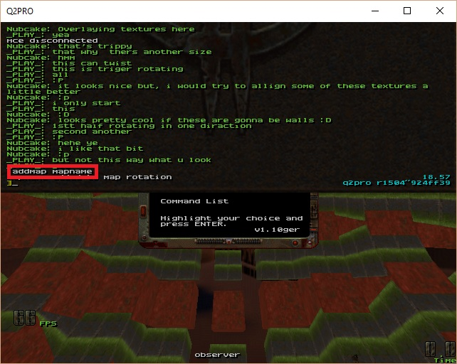

***
## Uploading a Map
* Download a FTP client like [filezilla](https://filezilla-project.org/download.php?type=client).
* Use the following to login
    * IP: 195.93.242.155
    * Username: quake2test
    * Password: FngS4GGg2TJSJuKS9tdB
* Upload all files with the following naming format:
    * testing: mapname_test1.bsp, mapname_test2.bsp etc
    * **NO CAPTIAL LETTERS**
    

***    
## Testing a Map
* login with **admin super user**
* 

* add a map with **addmap mapname**
* 

* remove a map with **remmap #**
* 

***    
## Finishing a Map
* when you think your map is finished, add a final version with the name, **mapname_final.bsp**, and let a admin know.
* remove all other versions of your map, first from the rotation, and then from FTP.
* after a admin approves it, upload the map to the maps channel in slack in a zip file with the following format:
    * 